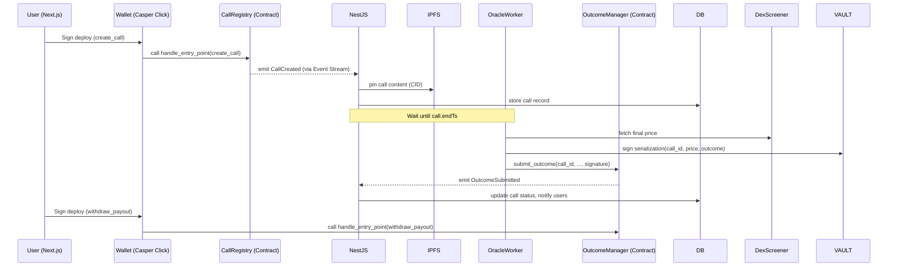

# BackIT (Onchain) - (Casper-Aligned, Odra Framework + Casper Click)

**Complete system design & architecture (ready-to-ship)**
Stack (final):
- **Frontend:** Next.js (App Router) + **Casper Click** (Wallet Provider + UI)
- **Wallet / Auth:** Casper Wallets (Casper Wallet, CasperDash, Ledger, etc.) via Casper Click
- **Backend:** NestJS (Oracle worker, event consumer, indexer)
- **DB:** PostgreSQL + Redis + BullMQ
- **Chain:** Casper Network (Testnet/Mainnet)
- **Contracts:** Rust, develop with **Odra Framework**.
- **Price sources:** DexScreener (primary) + GeckoTerminal (fallback)
- **Oracle model:** Off-chain Native Casper Signing (Ed25519/Secp256k1)
- **Indexing:** Casper Event Stream (SSE) + RPC polling

---

## Table of contents

1. Goals & invariants
2. High-level architecture diagrams
3. Component responsibilities (detailed)
4. On-chain design (contracts, events, interfaces)
5. Oracle & outcome verification (Native Signing flow)
6. Off-chain backend (NestJS) — services, DB, worker & indexer
7. Frontend (Next.js + Casper Click) — flows, UX details
8. Indexing, Casper RPC & Event Stream
9. Storage & content immutability (IPFS)
10. Security, reliability & audit checklist
11. Failure modes & mitigations
12. Deployments, dev tools & CI/CD (Odra + Cargo)
13. MVP roadmap & timelines
14. Appendices: DB schema, Contract snippets, Sequence diagrams

---

# 1 — Goals & invariants

- **Calls are immutable prediction objects**: token, condition, stake, startTs, endTs, contentCID (IPFS). On-chain stores minimal metadata.
- **Support for any token**: DexScreener coverage required.
- **Stakes**: Prefer CSPR or stablecoins (USDC bridged) for predictable payouts. Stakes are escrowed in the contract.
- **Outcome model**: Backend fetches price data at deadline, constructs a byte message (serialization of outcome data), signs it with the Oracle private key, and submits `submit_outcome` to the contract. Contract verifies the signature against a trusted Oracle public key.
- **User experience**: Leverage Casper Click for seamless multi-wallet support.
- **Simplicity & scalability**: Keep on-chain logic minimal, index events off-chain using the Casper Event Stream.
- **Security**: Oracle keys stored securely; contract uses Role-Based Access Control (RBAC) implementation in Odra.

---

# 2 — High-level architecture diagrams

## 2.1 System flow (overview)

```mermaid
flowchart TD
    User(User) --> Frontend[Next.js Frontend]
    Frontend --> Wallet[Casper Click (Wallet Connection)]
    Wallet --> Signer[Casper Application (User Key)]
    Signer --> Contracts[Casper Network Contracts (Odra)]
    Contracts --> OracleTrigger[Emit CallCreated Event]
    OracleTrigger --> Backend[NestJS Oracle Service (Event Stream)]
    Backend --> PriceSign[Signed Price Data]
    PriceSign --> Contracts
    Contracts --> Result[Validate Prediction and Settle Stakes]
    Result --> Frontend
```

## 2.2 Sequence: Create → Resolve → Payout



---

# 3 — Component responsibilities (detailed)

## 3.1 Frontend (Next.js + Casper Click)
- **Wallet / Auth**: `@make-software/csprclick-react` manages wallet connection and active account state.
- **Token discovery**: Proxy calls to backend `/tokens/search`.
- **Create Call UI**: Title, thesis, token selector, condition builder. Upload thesis to IPFS.
- **Transaction flow**: Construct `DeployUtil.makeStandardDeploy` or `makeDeploy` using `casper-js-sdk`, sign via Casper Click `sign` method, and send to network.
- **Feeds & Threads**: Pull from Postgres via NestJS endpoints.
- **Outcome provenance**: Show final price, signer public key, and signature data.

## 3.2 Off-chain Backend (NestJS)
- **Auth**: Verify ownership of public key via signature challenge (if needed for profile settings).
- **TokenDiscovery**: Normalize token metadata.
- **IndexerService**: Connect to Casper Node Event Stream (`/events/main`) to listen for contract events (`CallCreated`, `OutcomeSubmitted`).
- **OracleWorker**: Identify due calls, fetch prices, sign outcomes using backend `Ed25519` or `Secp256k1` key pair, submit `submit_outcome` deploy to network.
- **PinService**: Upload & pin call content to IPFS.
- **NotificationService**: WebSocket server / SSE for live feed pushes.

## 3.3 On-chain (Contracts - Odra)
- **CallRegistry**:
  - `create_call`: Registers a new call, transfers stake from user to contract.
  - `stake_on_call`: Allows others to back the call.
- **OutcomeManager**:
  - `submit_outcome`: Oracle submits result. Verifies signature against stored Oracle Public Key.
  - `withdraw_payout`: Winners claim their share.

## 3.4 Indexing & Storage
- **Casper Event Stream**: Primary source of truth for state changes.
- **Postgres**: Read model for UI.
- **IPFS**: Storage for text/media.

---

# 4 — On-chain design (contracts, events, interfaces)

## 4.1 Contracts & responsibilities
Built using **Odra v2.4**.

- **CallRegistry** (Module):
  - Storage: `Mapping<u64, Call>`, `Variable<u64>` (call_id_counter).
  - Entry Points: `create_call`, `stake_on_call`.
- **OutcomeManager** (Module):
  - Storage: `Mapping<u64, bool>` (settled), `Variable<PublicKey>` (oracle_public_key).
  - Entry Points: `submit_outcome`, `withdraw_payout`.

## 4.2 Data Structures & Events

### Call Struct
```rust
struct Call {
  creator: Address,
  stake_token: Address, // CEP-18 token address or similar
  total_stake: U256,
  start_ts: u64,
  end_ts: u64,
  token_address: String,
  pair_id: String,
  ipfs_cid: String,
  settled: bool,
  outcome: bool,
  final_price: U256,
}
```

### Events
- `CallCreated`: `call_id`, `creator`, `start_ts`, `end_ts`.
- `StakeAdded`: `call_id`, `staker`, `amount`.
- `OutcomeSubmitted`: `call_id`, `outcome`, `final_price`.
- `PayoutWithdrawn`: `call_id`, `recipient`, `amount`.

---

# 5 — Oracle & outcome verification (Native Signing flow)

## 5.1 Why Native Signing?
- Simple verification on-chain using `casper_contract::contract_api::runtime::verify_signature` (or Odra's crypto utils).
- No complex EIP-712 encoding required, just robust serialization of the data (using `CLValue` serialization).

## 5.2 Signing Data
The backend constructs a byte array to sign:
```rust
let data_to_sign = (call_id, outcome, final_price, timestamp).to_bytes()?;
```
This byte array is hashed (Blake2b or Keccak256) and signed.

## 5.3 Backend signing & submission flow
1. Worker picks due call.
2. Fetches price from DexScreener.
3. Determines outcome (true/false) and final price.
4. Serializes `(call_id, outcome, final_price, timestamp)` using `CLSerializer`.
5. Signs the bytes using the Oracle's Private Key (loaded from PEM).
6. Sends a deploy calling `submit_outcome` with arguments: `call_id`, `outcome`, `final_price`, `timestamp`, `signature` (Bytes).

## 5.4 On-chain verification logic
1. Contract reconstructs the bytes: `(call_id, outcome, final_price, timestamp).to_bytes()`.
2. Verifies the signature against the stored `oracle_public_key`.
3. If valid, updates state and emits event.

---

# 6 — Off-chain backend (NestJS) — detailed plan

## 6.1 Core modules
- **CallsModule**: Create drafts, IPFS pinning.
- **OracleModule**: Price fetcher, Casper `CasperServiceByJsonRPC` for reading state, signing logic.
- **IndexerModule**: Connects to Casper Event Stream (`EventStream`). Parses `DeployProcessed` events looking for specific contract package hashes and event names.
- **UsersModule**: Manage user profiles.

## 6.2 Indexer design
- Use `eventsource` to listen to the node's SSE endpoint.
- Filter for `Contract` events emitted by our contract package.
- Decode `CLValue` data from keys/transforms to update Postgres.

---

# 7 — Frontend (Next.js + Casper Click) — flows & UX details

## 7.1 Onboarding
- **Casper Click** provides a unified modal for Casper Wallet, Ledger, etc.
- No "login" required for read-only.
- Connect wallet -> Get Public Key -> Check if profile exists in DB.

## 7.2 Create Call
1. User fills form.
2. Frontend creates `Deploy` calling the `call_registry_contract` entry point `create_call`.
3. If staking CSPR, simply attach amount to deploy payment (or transfer argument). If staking CEP-18, might require `approve` step first.
4. Casper Click `sign` -> Send to network.
5. Watch for execution success.

---

# 8 — Indexing, Casper RPC & Event Stream

## 8.1 RPC & Provider strategy
- Use publicly available Casper Testnet/Mainnet RPC nodes (e.g., CSPR.live, various validators).
- Configurable via `.env`.

## 8.2 Real-time
- Backend listens to SSE.
- Pushes to frontend via Socket.io / SSE.

---

# 9 — Storage & content immutability

- **IPFS**: Pin all textual content (theses, descriptions).
- Store CID in the Contract `Call` struct.

---

# 10 — Security, reliability & audit checklist

## 10.1 Contracts
- **Odra Testing**: Extensive unit and integration tests using `odra-test` (WASM context).
- **Access Control**: Ensure only `oracle_public_key` can call `submit_outcome`.

## 10.2 Keys
- Oracle Private Key stored in `.pem` file (loaded via env/secret manager). Do NOT commit to git.

---

# 12 — Deployments, dev tools & CI/CD

## 12.1 Odra (primary for contracts)
- Build: `cargo odra build`
- Test: `cargo odra test`
- Deploy: `cargo run --bin deploy` (using `odra-casper-livenet` backend if applicable) or usage of `casper-client` CLI.

## 12.2 Backend & Frontend
- Standard Docker / Node workflows.

---

# 14 — Appendices

## Appendix A — Foundry contract comparison
*Removed EVM Code. See `packages/contracts-odra/src` for actual Rust implementation.*
